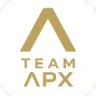

<h1 align="center">
  TeamApx Website
  <br>
  
</h1>


Offizielle Website des **TeamApx E-Sport Teams** und seiner Community.  
Ziel der Seite ist es, einen zentralen Raum für Teaminfos, Community-Updates, Bewerbungen und wöchentliche Statistiken zu schaffen – alles übersichtlich und intuitiv dargestellt.

---

## 🌐 Live

[https://apx-team.com](https://apx-team.com)

## 📖 Inhalt / Features

- **Teamübersicht** – alle Mitglieder, Rollen und Infos auf einen Blick
- **Online Bewerbungsformular** – Bewerbungen direkt über die Website einreichen
- **Events** – kommende Turniere, Matches und Veranstaltungen
- **Wöchentliche Statistiken & Updates** – Team- und Community-Performance
- **Social Links** – Zugriff auf unsere Social-Media-Kanäle
- **About Us** – Hintergrundinfos zum Team
- **Mehrsprachigkeit** – Deutsch & Englisch
- **Login-System** (in Arbeit) – für Bewerber und später für interne Features

> Weitere Features werden in zukünftigen Updates hinzugefügt.

---

## 🛠️ Technologie Stack

- **Frontend:** HTML, CSS, JavaScript
- **Backend:** Go
- **Datenbank:** SQL, teils JSON
- **Build & Deployment:** Docker (optional), Nginx auf eigenem Server
- **Hosting:** Privater Server mit eigener Domain

---

## 🚧 Projektstatus

**Work in Progress** – Viele Features sind in Entwicklung, z. B. Login-System, interne Statistikbereiche und weitere Community-Tools.

---

## 💻 Entwicklung / Lokales Testen

1. Repository klonen:

```bash
git clone https://github.com/apx-group/TeamApx.git
cd TeamApx
```
```bash
go run .
```

## ⚖️ Lizenz
Dieses Projekt ist unter der **MIT Lizenz** lizenziert – siehe LICENSE.

## 👤 Kontakt
- **E-Mail:** team.apx.r6@gmail.com
- **TeamApx:** https://apx-team.com
- **Entwickler / Maintainer:** LIXH